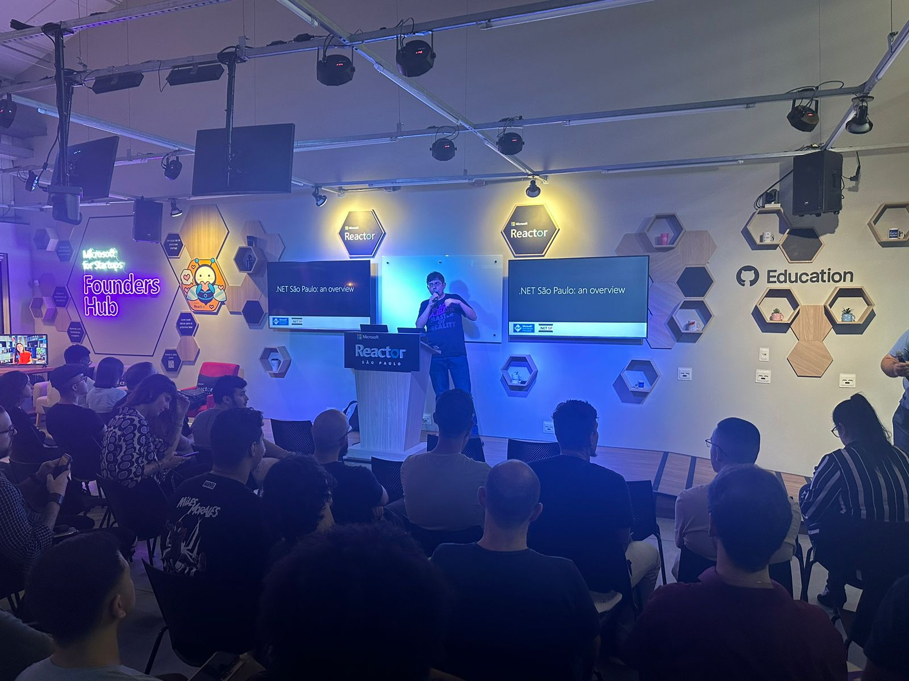
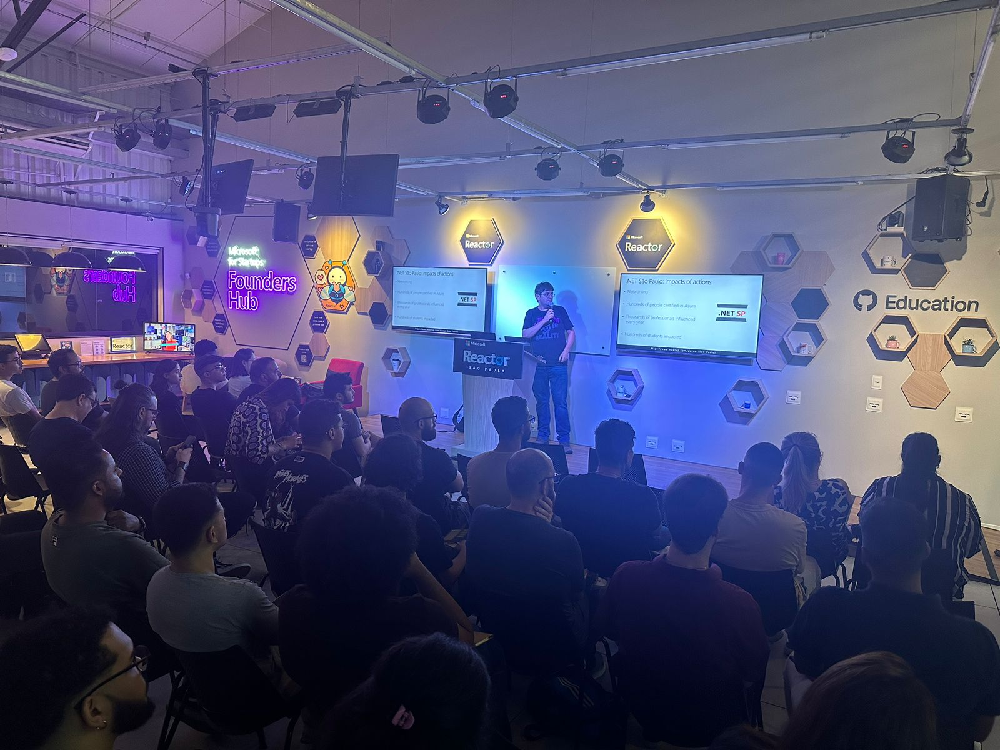
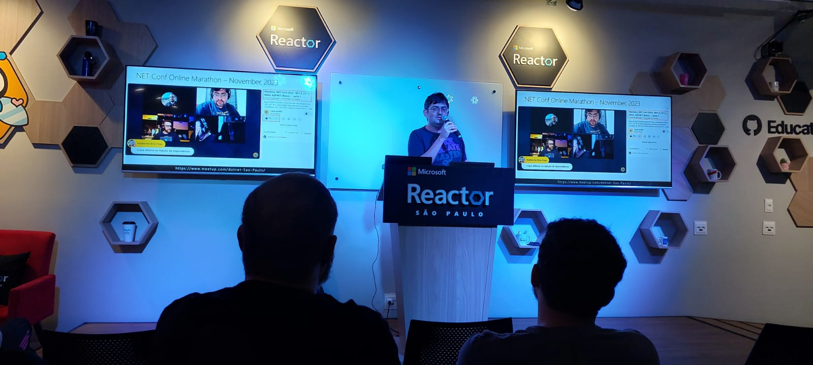
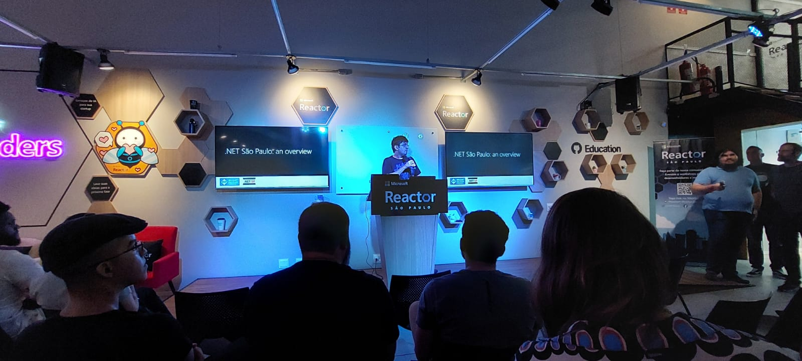
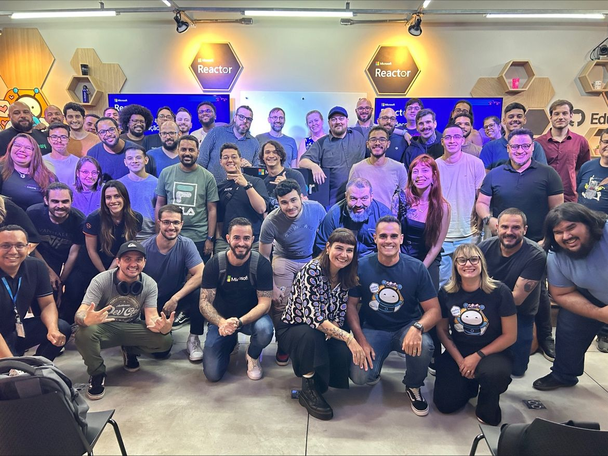
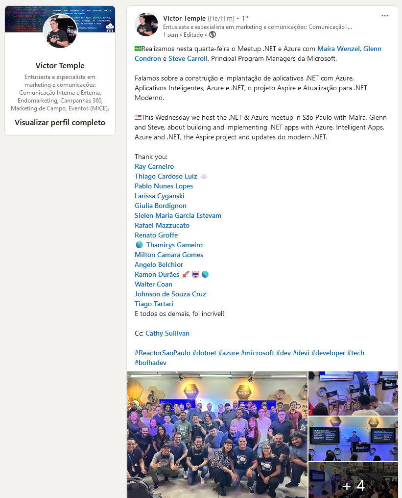

# Meetup-MicrosoftReactor-2024-03
Fotos e slides de apresentação realizada no Microsoft Reactor em São Paulo-SP no dia 20/03/2024.

---

Título da Apresentação: **.NET São Paulo: uma visão geral**

Data: **20/03/2024 (quarta-feira)**

Tópicos abordados: **o Meetup .NET São Paulo, .NET, C#, ASP.NET Core, Microsoft Azure, Kubernetes, Open Source, Comunidades Técnicas**

Número de participantes: **55 pessoas**

Link do evento: [**LinkedIn**](https://www.linkedin.com/posts/victortemple_reactorsaopaulo-dotnet-azure-activity-7177017787981197312-wHdr?utm_source=share&utm_medium=member_desktop)

Deixo aqui meus agradecimentos ao **Victor Temple** e à **Larissa Cyganski** pelo convite e oportunidade em participar como palestrante deste meetup que contou com a presença de funcionários da Microsoft, Microsoft MVPs, Tech Influencers e membros de empresas parceiras da Microsoft.

E meu muito obrigado também aos amigos **Walter Coan (Microsoft MVP)** e **Angelo Belchior (Microsoft MVP)** pelas fotos tiradas durante o evento.

Na pasta [**/img**](img/) estão fotos do evento e da minha apresentação.

---

